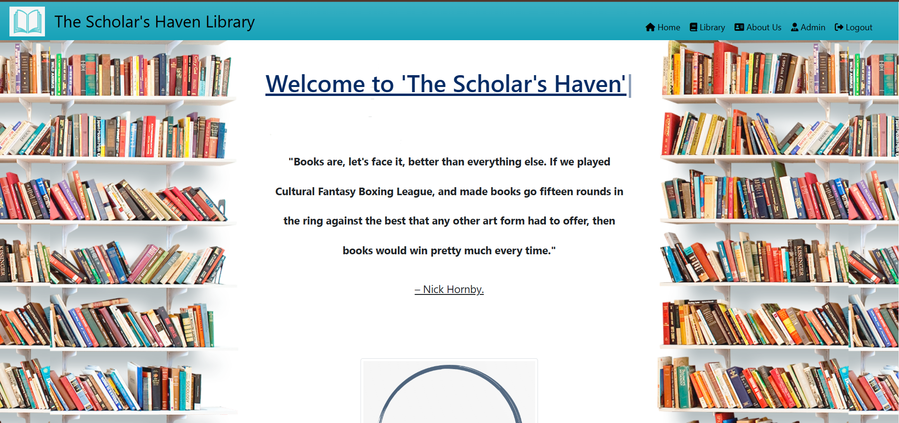

# Django Library Project
This is a Django-based library management system that provides various functionalities such as managing student profiles, book collections, and newspapers. The project is built with Django, Python, and SQLite, with a focus on usability and performance.

### Features
* User Management: Handles user registration and authentication.
* Student Profiles: Stores and displays personal information of students (e.g., full name, phone number, education type, pursuing year).
* Books Management: Allows students to view and borrow books based on their branch.
* Newspaper Integration: Fetches and displays news from selected sources.
* RESTful API: Provides API endpoints for managing student profiles, books, and newspapers.
* Guest User Support: Allows guest users to browse the library without logging in, and deletes their data upon logout.

### Technologies Used
* Django: A high-level Python web framework.
* SQLite: A lightweight database for development.
* Bootstrap: Front-end framework for styling.
* JavaScript: For dynamic web content (e.g., currency converter).
* Python 3.9: The programming language used for the project.


## Installation

1. Clone the repository:

```bash
  https://github.com/Onkar2104/Django_Library.git
```
2. Navigate to the project folder:

```bash
    cd Django_Library
```

3. Set up a virtual environment (optional but recommended):
```bash
    python3 -m venv venv
    source venv/bin/activate  # On Windows: venv\Scripts\activate  
```
4. Install dependencies:
```bash
    pip install -r requirements.txt
```
5. Apply migrations:
```bash
    python manage.py migrate
```
6. Create a superuser to access the admin panel:
```bash
    python manage.py createsuperuser
```
7. Run the development server:
```bash
    python manage.py runserver
```
8. Access the app in your browser at:
```bash
    http://127.0.0.1:8000
```
## Live Demo

[The Scholar's Haven](`http://52.66.255.93/`)

Visit the site.


## Screenshots


